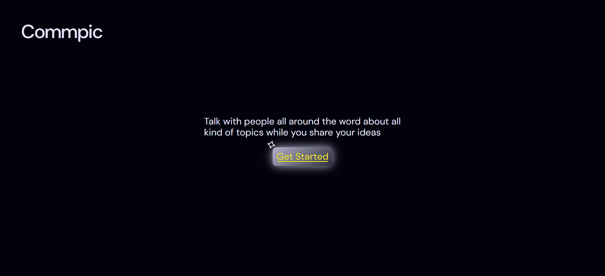

# Commpic
Commpic is a web page that can be used to talk about any topic with people all around the word.

## Screenshots 
| *Landing page* | *Log in* |
|:--------------:|:--------------:|
|  |  |

## Run Locally
Clone the project
```bash
  git clone https://github.com/wisyxx/Commpic.git
```

Go to the project directory
```bash
  cd Commpic
```

Install dependencies
```bash
  npm install
```

Start php server and gulp tasks
```bash
  php -S localhost:3000
```
```bash
  npm start
```
## Feedback
If you have any feedback, please reach out to me at alvarohcolino@gmail.com 
## License

[](https://choosealicense.com/licenses/mit/)
